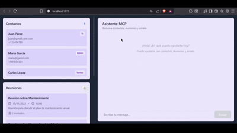

# Agente de Asistencia de Oficina

Un asistente inteligente diseñado para optimizar la productividad diaria de los empleados, gestionando reuniones, contactos y correos electrónicos de manera automática y conversacional.

---

## Descripción del Problema abordado

En el entorno laboral moderno, los empleados pasan una gran cantidad de tiempo gestionando tareas administrativas como agendar reuniones, buscar contactos o enviar emails. Esto distrae su atención de las actividades estratégicas y creativas.

Este proyecto resuelve ese problema creando un **agente conversacional** que actúa como un asistente personal. El usuario puede interactuar con él mediante un chat natural, solicitando acciones como:

- Agendar, reprogramar o eliminar reuniones.
- Buscar, agregar o editar contactos.
- Enviar emails a sus contactos.

El sistema está diseñado para ser intuitivo, eficiente y útil, permitiendo al empleado enfocarse en lo que realmente importa: su trabajo.

---

## Demo (GIF Animado)



_En esta demostración, el usuario le pide al agente que envíe un email a "Calos López" con un recordatorio. El agente ejecuta la acción y confirma el envío, actualizando la interfaz en tiempo real._

---

## Stack Tecnológico

El proyecto se construyó utilizando las siguientes tecnologías:

- **Backend:**

  - `FastAPI`: Para crear los endpoints REST y servir la lógica del agente.
  - `LangChain`: Para conectar el modelo de IA con las herramientas (tools).
  - `Pydantic`: Para definir modelos de datos y validación.
  - `Google Gemini API` (`gemini-2.5-flash`): Modelo de lenguaje utilizado para la interacción conversacional.
  - `MCP Server` (`mcp.server.fastmcp`): Para exponer las herramientas (tools) de gestión de reuniones, contactos y emails.
  - `uvicorn`: Servidor ASGI para ejecutar FastAPI.

- **Frontend:**

  - Interfaz web ( Vite + React + Tailwind CSS) que consume los endpoints `/chat`, `/contactos`, `/reuniones` y `/emails`.

- **Otros:**
  - `dotenv`: Para manejar variables de entorno.
  - `CORS Middleware`: Para permitir solicitudes desde el frontend.

---

## Instrucciones de Instalación

1. **Clonar el repositorio:**

   ```bash
   git clone https://github.com/MACHINE-LEARNING-tlp3/MCP-OFFICE-AGENT.git
   cd MCP-OFFICE-AGENT
   ```

2. **Crear un entorno virtual dentro del backend:**

   ```bash
   cd mcp-oficina
   python -m venv env
   source ./env/Scripts/activate  # En Windows: env\Scripts\activate
   ```

---

3. **Instalar las dependencias:**

   ```bash
   pip install -r requirements.txt
   ```

4. **Configura variables de entorno:**

   Crea un archivo .env en la carpeta mcp-oficina con las siguientes variables:

   ```bash
   GOOGLE_API_KEY=tu_clave_api_de_gemini
   MCP_SERVER_URL=http://localhost:8000
   AGENT_PORT=8001
   AGENT_HOST=127.0.0.1
   ```

5. **Iniciar el servidor MCP:**

   ```bash
   python mcp_server.py
   ```

6. **Iniciar el servidor del agente:**

   ```bash
   python agent_server.py
   ```

7. **Iniciar el frontend:**

```bash
cd frontend
npm install
npm run dev
```

8. **Interactuar con el agente:**
   Abre la interfaz del frontend y comienza a chatear con el asistente. Por ejemplo:

- “Agenda una reunión con Juan y María para el viernes a las 10.”
- “Busca contactos con nombre ‘Juan’.”
- “Envia un email a Juan con un recordatorio para la reunión.”
- etc.

### Funcionalidades Implementadas

- Agendar reuniones: El usuario puede especificar título, día, hora e invitados.
- Consultar reuniones: El agente puede mostrar una lista de reuniones programadas.
- Reprogramar reuniones: El agente puede cambiar la fecha y hora de una reunión existente.
- Gestión de contactos: Permite buscar, agregar, editar y eliminar contactos.
- Enviar emails simulados: Envía un email a un contacto y lo registra en el historial.

### Estructura del proyecto

```bash
MCP-OFFICE-AGENT/
├── frontend/                     # Frontend del agente
│   ├── App.tsx                   # Componente principal
│   └── src/                      # Código fuente del frontend
│       └── components/
│           ├── Chat.tsx
│           ├── Contactos.tsx
│           ├── Reuniones.tsx
│           └── Emails.tsx
│
├── mcp-oficina/                  # Backend y servidor MCP
│   ├── mcp_server.py             # Tools MCP: reuniones, contactos y emails
│   ├── agent_server.py           # Servidor del agente (LangChain + Gemini)
│   ├── models.py                 # Modelos Pydantic
│   └── requirements.txt          # Dependencias Python
│
└── README.md                     # Documentación del proyecto


```
---

### Autoras del proyecto

- **Tatiana Medina**: [GitHub](https://github.com/tatymediina)
- **Ailín Miño**: [GitHub](https://github.com/ayelenailin-m)


